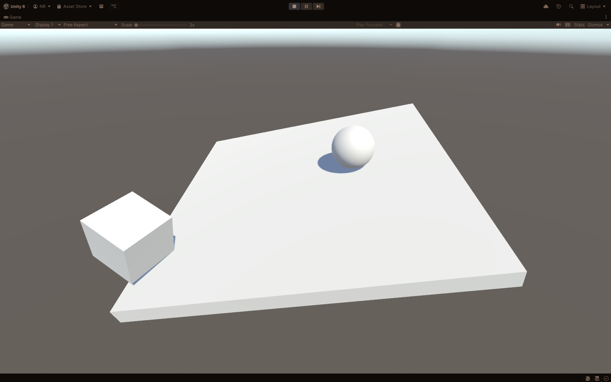

`-*- mode: visual-line; -*-`

# formative
Unity project for formative assessment.

## FORMATIVE OVERVIEW

The task for this formative exercise is to reconstruct the falling blocks and hinged platform scene demonstrated in Session 5.

To summarise:

- The falling blocks are created at regular intervals above the platform, at a random X/Z location
- The blocks are black when they are created
- The blocks turn red when they hit the platform (*)
- The blocks are destroyed when they drop a certain distance

You have been provided with a starter project (`formative-starter`) which contains a platform and a couple of scene objects which drop onto it when the scene starts. The starter project also contains all of the scripts you'll need for the final project, and can be used without alteration - you just have to work out how to use them. (Some of the scripts may need to be configured from the Unity control panel.)

You should have working code for most of the relevant concepts, and can refer back to the presentation material from previous weeks. As a reminder:

- This starter physics project is essentially what we built in Session 4
- The object self-colouring behaviour was explored in Session 2
- Spawning was covered in Session 5
- We didn't quite get to collision detection in Session 5, but it's covered in the slides

## STEPS

- Clone this repo and the Unity project it contains to your own GitHub space, then clone to download
- Open in Unity `6000.2.8f1` or later (earlier Unity 6.2 versions might work, but that's not guaranteed)
- Commit and push your work back to your Git repository

## STRETCH GOAL

(*) At the moment, falling objects turn black when they are created and red when they collide with anything. Make them turn black only when they collide with each other, and red when they collide with the platform.

We'll do a peer-review of progress via each other's Git repositories in Session 6.
